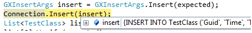

# Gurux ORM

See [Gurux](http://www.gurux.org/ "Gurux") for an overview.  
Join the Gurux Community or follow [@Gurux](http://twitter.com/guruxorg "@Gurux") for project updates.

**Gurux ORM** is an open-source **Object Relational Mapping (ORM)** component for **C#**, part of the **Gurux Device Framework**.  
Its goal is to provide a **fast** and **easy-to-use** ORM that works across multiple database engines.

---

## ✨ Features

- Unified ORM interface for multiple databases  
- Automatic table creation and relation traversal  
- See generated SQL in debug mode (hover on the argument)  
- Lambda-expression query support  
- Attribute-driven schema mapping  
- Supports `1:1`, `1:N`, and `N:N` relationships

---

## 🗃️ Supported Databases

- [MySQL](http://www.mysql.com/)
- [MariaDB](http://www.mariadb.com/)
- [Microsoft SQL Server](http://www.microsoft.com/)
- [Oracle](http://www.oracle.com/)
- [SQLite](http://www.sqlite.com/)

---

## ⚙️ Key Attributes

| Attribute | Description |
| --- | --- |
| `DataMember` | Marks a field to be stored in the database. |
| `AutoIncrement` | Increases on insert; value is written back to the object. |
| `ForeignKey` | Defines a foreign key relation. |
| `Relation` | Declares a relation between tables. |
| `Alias` | SQL alias for fields/tables. |
| `UseEnumStringValue` | Save enums as strings (default is integer). |
| `UseEpochTimeFormat` | Store dates as UNIX epoch. |
| `StringLength(int max)` | Validates and limits string length in the schema. |
| `IsRequired` | Field must have a value (NOT NULL). |

---

## 🔗 Relations

Gurux ORM supports:

- **1:1** — One-to-One  
- **1:N** — One-to-Many  
- **N:N** — Many-to-Many

---

## 🏗️ Defining C# Classes

All ORM classes must implement `IUnique<T>`, ensuring a unique ID for each object.  
This makes lookups faster and relations easier to manage.

---

## Models

### Country ↔ Company (1:N)

`GXCountry` maintains a list of its companies and cascades deletes.

```csharp
[DataContract]
class GXCountry : IUnique<int>
{
    [DataMember(Name = "ID"), AutoIncrement]
    public int Id { get; set; }

    [DataMember(Name = "CountryName"), IsRequired, StringLength(100)]
    public string Name { get; set; }

    [DataMember]
    [ForeignKey(OnDelete = ForeignKeyDelete.Cascade)]
    public List<GXCompany> Companies { get; set; }
}

[DataContract]
class GXCompany : IUnique<long>
{
    [AutoIncrement, DataMember]
    public long Id { get; set; }

    [DataMember, IsRequired, StringLength(150)]
    public string Name { get; set; }

    // Navigation to Country; FK column is auto-managed (e.g., CountryID)
    [DataMember(Name = "CountryID"), ForeignKey]
    public GXCountry Country { get; set; }
}
```

**Usage Example:**

```csharp
GXCountry finland = new GXCountry { Name = "Finland" };
GXCompany gurux = new GXCompany { Name = "Gurux Ltd", Country = finland };
GXCompany sample = new GXCompany { Name = "Sample Co", Country = finland };
finland.Companies = new List<GXCompany> { gurux, sample };

// Create Country and all related tables in one go (including Company)
Connection.CreateTable<GXCountry>(true, false);

Connection.Insert(GXInsertArgs.Insert(finland));
```

---

### Company ↔ Users (1:N)

`GXUser` holds a direct reference to `GXCompany` (no `CompanyId`).

```csharp
[DataContract]
class GXCompany : IUnique<long>
{
    [AutoIncrement, DataMember]
    public long Id { get; set; }

    [DataMember, IsRequired, StringLength(150)]
    public string Name { get; set; }

    [DataMember, ForeignKey(OnDelete = ForeignKeyDelete.Cascade)]
    public GXUser[] Users { get; set; }
}

[DataContract]
class GXUser : IUnique<int>
{
    [AutoIncrement, DataMember]
    public int Id { get; set; }

    [DataMember, IsRequired, StringLength(120)]
    public string Name { get; set; }

    [DataMember, ForeignKey(OnDelete = ForeignKeyDelete.Cascade)]
    public GXCompany Company { get; set; }
}
```

**Usage Example:**

```csharp
GXCompany company = new GXCompany { Name = "Gurux Ltd" };
GXUser u1 = new GXUser { Name = "Alice", Company = company };
GXUser u2 = new GXUser { Name = "Bob", Company = company };
company.Users = new[] { u1, u2 };

// Create Company and all related tables (Users) in one go
Connection.CreateTable<GXCompany>(true, false);

Connection.Insert(GXInsertArgs.Insert(company));
```

---

### Users ↔ UserGroups (N:N)

```csharp
[DataContract]
class GXUser : IUnique<int>
{
    [AutoIncrement, DataMember]
    public int Id { get; set; }

    [DataMember, IsRequired, StringLength(120)]
    public string Name { get; set; }

    [DataMember, ForeignKey(typeof(GXUserGroup), typeof(GXUserToUserGroup))]
    public GXUserGroup[] Groups { get; set; }

    [DataMember, ForeignKey(OnDelete = ForeignKeyDelete.Cascade)]
    public GXCompany Company { get; set; }
}

[DataContract]
class GXUserGroup : IUnique<int>
{
    [AutoIncrement, DataMember]
    public int Id { get; set; }

    [DataMember, IsRequired, StringLength(120)]
    public string Name { get; set; }

    [DataMember, ForeignKey(typeof(GXUser), typeof(GXUserToUserGroup))]
    public GXUser[] Users { get; set; }
}

[DataContract]
class GXUserToUserGroup
{
    [DataMember, ForeignKey(typeof(GXUser), OnDelete = ForeignKeyDelete.Cascade)]
    public int UserId { get; set; }

    [DataMember, ForeignKey(typeof(GXUserGroup), OnDelete = ForeignKeyDelete.Cascade)]
    public int GroupId { get; set; }
}
```

**Usage Example:**

```csharp
GXUserGroup adminGroup = new GXUserGroup { Name = "Admin" };
GXUserGroup devGroup = new GXUserGroup { Name = "Developers" };

GXCompany gurux = new GXCompany { Name = "Gurux Ltd" };
GXUser user = new GXUser
{
    Name = "Charlie",
    Company = gurux,
    Groups = new[] { adminGroup, devGroup }
};

// Create UserGroup and all related tables (bridge + users + company) in one go
Connection.CreateTable<GXUserGroup>(true, false);

Connection.Insert(GXInsertArgs.Insert(user));
```

---

## ⚡ Quick Start

Create all related tables with a single call, do CRUD, and prefer `GXDeleteArgs.Delete(obj)` when you have the instance.

```csharp
using Gurux.ORM;
using System.Collections.Generic;
using System.Data.SQLite;

class Program
{
    static void Main()
    {
        // 1. Connect to SQLite (you can also use MySQL, SQL Server, etc.)
        var sqlite = new SQLiteConnection("Data Source=:memory:");
        var Connection = new GXDbConnection(sqlite, null);

        // 2. Create all related tables starting from GXCountry
        Connection.CreateTable<GXCountry>(true, false);

        // 3. Insert data
        GXCountry finland = new GXCountry { Name = "Finland" };
        GXCompany gurux = new GXCompany { Name = "Gurux Ltd", Country = finland };
        GXCompany sample = new GXCompany { Name = "Sample Co", Country = finland };
        finland.Companies = new List<GXCompany> { gurux, sample };
        Connection.Insert(GXInsertArgs.Insert(finland));

        GXUser john = new GXUser { Name = "John", Company = gurux };
        GXUser jane = new GXUser { Name = "Jane", Company = gurux };
        Connection.Insert(GXInsertArgs.Insert(john));
        Connection.Insert(GXInsertArgs.Insert(jane));

        GXUserGroup devs = new GXUserGroup { Name = "Developers" };
        john.Groups = new[] { devs };
        Connection.Insert(GXInsertArgs.Insert(john));

        // 4. Query data
        GXSelectArgs selectUsers = GXSelectArgs.SelectAll<GXUser>();
        List<GXUser> users = Connection.Select<GXUser>(selectUsers);

        // 5. Update data
        john.Name = "John Updated";
        Connection.Update(GXUpdateArgs.Update(john, q => q.Name));

        // 6. Delete data (preferred when you have the instance)
        Connection.Delete(GXDeleteArgs.Delete(john));
    }
}
```

---

## 🔍 Query Examples

### N:N Join (Users ↔ Groups)

```csharp
GXSelectArgs arg = GXSelectArgs.Select<GXUser>(s => "*");
arg.Columns.Add<GXUserGroup>();
arg.Joins.AddInnerJoin<GXUser, GXUserToUserGroup>(j => j.Id, j => j.UserId);
arg.Joins.AddInnerJoin<GXUserToUserGroup, GXUserGroup>(j => j.GroupId, j => j.Id);

var list = Connection.Select<GXUser>(arg);
```

#### Filtering & sorting for N:N

Only users in the "Developers" group, ascending by user name:

```csharp
GXSelectArgs arg = GXSelectArgs.Select<GXUser>(s => "*");
arg.Columns.Add<GXUserGroup>();
arg.Joins.AddInnerJoin<GXUser, GXUserToUserGroup>(j => j.Id, j => j.UserId);
arg.Joins.AddInnerJoin<GXUserToUserGroup, GXUserGroup>(j => j.GroupId, j => j.Id);

// Filter: group name equals "Developers"
arg.Where.And<GXUserGroup>(g => g.Name == "Developers");

// Sort: users by Name (ascending)
arg.OrderBy.Add<GXUser>(u => u.Name, true);

var developers = Connection.Select<GXUser>(arg);
```

**Alternative (portable) approach using a subquery:**

```csharp
// Subquery: find group IDs with name 'Developers'
var groupsSub = GXSelectArgs.Select<GXUserGroup>(g => g.Id, g => g.Name == "Developers");

// Users whose Groups contain one of the subquery results
var usersInDevs = GXSelectArgs.Select<GXUser>(
    s => "*",
    u => GXSql.In(u => u.Groups, groupsSub)
);

// Optional sort
usersInDevs.OrderBy.Add<GXUser>(u => u.Name, true);

var developers2 = Connection.Select<GXUser>(usersInDevs);
```

---

### Separate blocks for filtering and sorting

#### Filtering only

```csharp
GXSelectArgs arg = GXSelectArgs.Select<GXUser>(s => "*");
arg.Where.And<GXUser>(c => c.Name.StartsWith("Cha"));

var filtered = Connection.Select<GXUser>(arg);
```

#### Sorting only

```csharp
GXSelectArgs arg = GXSelectArgs.Select<GXUser>(s => "*");
arg.OrderBy.Add<GXUser>(c => c.Name);

var sorted = Connection.Select<GXUser>(arg);
```

> You can also combine:
> 
> ```csharp
> GXSelectArgs arg = GXSelectArgs.Select<GXUser>(s => "*");
> arg.Where.And<GXUser>(c => c.Name.StartsWith("Cha"));
> arg.OrderBy.Add<GXUser>(c => c.Name);
> var result = Connection.Select<GXUser>(arg);
> ```

---

### Selecting Related Data (1:N Join Example)

```csharp
GXSelectArgs arg = GXSelectArgs.SelectAll<GXCountry>();
arg.Columns.Add<GXCompany>();
arg.Joins.AddInnerJoin<GXCountry, GXCompany>(c => c.Id, c => c.Country);
List<GXCountry> countries = Connection.Select<GXCountry>(arg);
```

---

## 🚫 `Exclude<T>()` (Select & Update)

Use `Exclude<T>()` to omit specific fields from **queries** and **updates**. Great for skipping heavy columns on read and avoiding server-managed columns on update.

**Exclude in Select**

```csharp
// Select all fields for GXUser, but exclude heavy/sensitive ones
GXSelectArgs args = GXSelectArgs.SelectAll<GXUser>(it);
args.Exclude<GXUser>(q => new
{
    // Fields to exclude from the query result:
    // e.g., q.PasswordHash, q.ProfileImageBlob, q.InternalNote
});

var users = Connection.Select<GXUser>(args);
```

**Exclude in Update**

```csharp
// Update from an instance 'it' while skipping server-managed or immutable fields
GXUpdateArgs args = GXUpdateArgs.Update(it);
args.Exclude<GXUser>(q => new
{
    // Fields to exclude from updates:
    // e.g., q.Id, q.CreatedAt, q.Company, q.PasswordHash
});

Connection.Update(args);
```

**Practical example**

```csharp
// READ: don't fetch large binary data or secrets
GXSelectArgs s = GXSelectArgs.SelectAll<GXUser>(it);
s.Exclude<GXUser>(q => new { q.PasswordHash, q.AvatarBlob });
var list = Connection.Select<GXUser>(s);

// UPDATE: avoid changing keys or audit fields
GXUpdateArgs u = GXUpdateArgs.Update(it);
u.Exclude<GXUser>(q => new { q.Id, q.Company, q.CreatedAt, q.UpdatedAt });
Connection.Update(u);
```

---

## 🔁 Update

```csharp
user.Name = "UpdatedName";
Connection.Update(GXUpdateArgs.Update(user, q => q.Name));
```

---

## ❌ Delete

```csharp
// Preferred when you have the instance:
Connection.Delete(GXDeleteArgs.Delete(user));

// If only the ID is known:
Connection.Delete(GXDeleteArgs.DeleteById<GXUser>(5));
```

---

## 🧠 Subqueries

```csharp
GXSelectArgs sub = GXSelectArgs.Select<GXUser>(q => q.Id, q => q.Id > 100);
GXSelectArgs arg = GXSelectArgs.Select<GXUserGroup>(null, q => q.Id > GXSql.In(q => q.Users, sub));
```

---

---

## Check is table empty.

```csharp
GXSelectArgs arg = GXSelectArgs.IsEmpty<GXUser>()
if (Connection.SingleOrDefault<bool>(arg))
{
    // Table is empty
}
else
{
    // Table has at least 1 record
}
```

---

## 📚 Further Resources

For examples and tests, check:  
`Gurux.Service_Simple_UnitTests` directory

Need help?  
Ask your questions on the [Gurux Forum](https://gurux.fi/forum/103).

---


